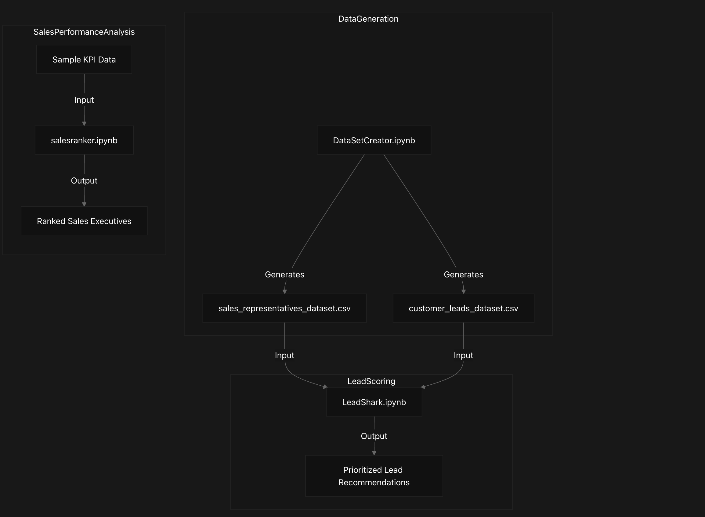
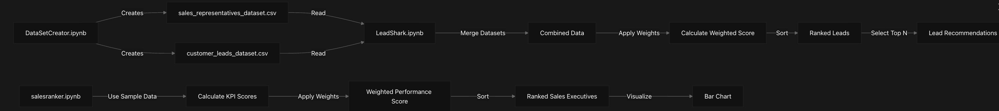
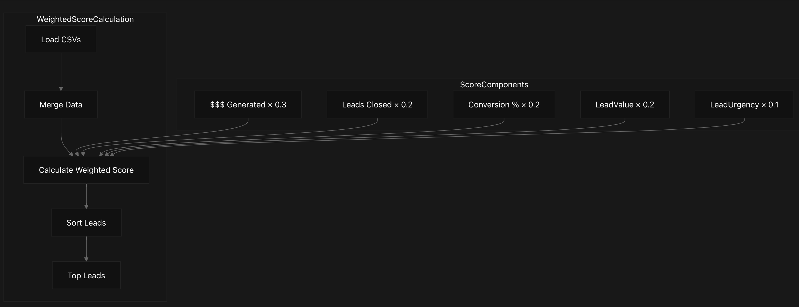
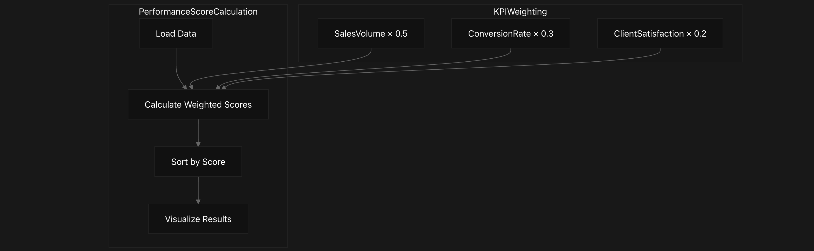

# LeadShark Overview
This document provides a technical overview of the LeadShark system, a sales intelligence and lead management platform designed to help sales teams prioritize leads and evaluate sales representative performance through data-driven analysis.

## System Architecture
LeadShark consists of three primary components that work together to provide sales intelligence capabilities:

## Data Flow
The following diagram illustrates how data flows through the LeadShark system:

## Core Components
### 1. Data Generation (DataSetCreator.ipynb)
This component generates synthetic datasets to simulate real-world sales data:

- Creates a dataset of 1000 sales representatives with performance metrics
- Creates a dataset of 1000 customer leads with relevant attributes
- Uses a fixed random seed (42) for reproducibility
- Outputs data to CSV files for use by other components

### 2. Lead Scoring (LeadShark.ipynb)
This component analyzes and prioritizes leads based on a weighted scoring algorithm:

- Loads sales representative and customer lead CSV files
- Merges datasets on LeadID and SalesRepID
- Applies a weighted scoring algorithm to calculate lead priority
- Ranks leads by their weighted score
- Recommends the top N leads for sales representatives to pursue

### 3. Sales Performance Analysis (salesranker.ipynb)
This component evaluates and ranks sales representatives based on their performance:

- Currently uses sample data rather than the generated CSVs
- Calculates weighted scores based on key performance indicators
- Ranks sales executives by their overall performance score
- Provides visualization of the ranking results

## Dataset Schemas
LeadShark operates on two primary datasets:

### Sales Representatives Dataset
Field Name	Description	Data Type
SalesRepID	Unique identifier	Integer
SalesRepName	Representative name	String
$$$ Generated	Revenue generated	Float
Leads Closed	Number of closed leads	Integer
Touches	Number of customer interactions	Integer
Conversion %	Conversion percentage	Float
Client Meetings	Number of meetings	Integer
Email Responses	Number of email responses	Integer
Calls Made	Number of calls	Integer
Follow-ups	Number of follow-ups	Integer

### Customer Leads Dataset
Field Name	Description	Data Type
LeadID	Unique identifier	Integer
LeadName	Lead name	String
Contacted	Contact status	Boolean
$$$ Potential	Potential revenue	Float
Lead Source	Origin of lead	String
Industry	Business sector	String
Initial Contact Date	First contact date	Date
Last Follow-up Date	Latest follow-up date	Date
Lead Score	Internal score	Integer
Interested Products	Products of interest	String

## Scoring Algorithms
### Lead Scoring Algorithm
LeadShark prioritizes leads using a weighted scoring system:

## Sales Representative Ranking Algorithm
SalesRanker evaluates representatives with a weighted KPI system:

Technical Implementation
Code Dependencies
The LeadShark system relies on the following Python libraries:

pandas: Data manipulation and analysis
numpy: Numerical operations and random data generation
plotly.express: Data visualization (used in salesranker)
Data Generation Implementation
The DataSetCreator.ipynb notebook:

Sets a random seed (42) for reproducibility
Generates sales representative data with 10 fields
Generates customer leads data with 10 fields
Saves both datasets to CSV files
Lead Scoring Implementation
The LeadShark.ipynb notebook:

Loads the CSV files using pandas
Merges datasets on LeadID and SalesRepID
Applies the weighted scoring formula
Sorts leads by score
Returns the top N leads as recommendations

Sales Ranking Implementation
The salesranker.ipynb notebook:

Creates sample sales executive data
Defines weights for different KPIs
Calculates a weighted score for each executive
Sorts executives by their score
Visualizes the ranking using a bar chart

## Current Limitations
The LeadShark system has several limitations in its current implementation:
1. Data Integration Error: The lead scoring algorithm references columns (LeadValue and LeadUrgency) that don't exist in the dataset, causing execution failure.
2. Static Configuration: Scoring weights are hard-coded rather than configurable at runtime.
3. Limited Integration: The SalesRanker component uses sample data rather than connecting to the generated CSV files.
4. Basic Visualization: The system provides only basic visualization capabilities.
5. No Error Handling: The system lacks robust error handling and data validation.

## Future Enhancement Opportunities
Areas for potential system improvement include:

1. Fix the column reference error in LeadShark.ipynb
2. Make scoring weights configurable via parameters
3. Integrate the SalesRanker with the actual CSV data
4. Add comprehensive data validation
5. Develop more advanced visualization and reporting
6. Create a unified interface connecting all components
